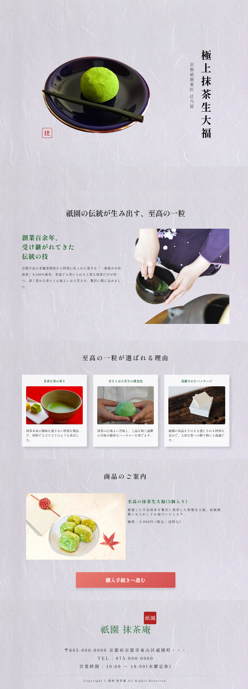

# 祇園 抹茶庵 LP（ランディングページ）

和風カフェ「祇園 抹茶庵」の集客・ブランディングを目的としたランディングページです。GIMPによるデザインカンプ作成からHTML/CSSでの実装・レスポンシブ対応まで一貫して制作しました。

---

## サイトURL（GitHub Pages） https://norihumi.github.io/japanese-sweet-lp/

## デザイン仕様

### [コンセプト]
- **和の高級感と老舗の情緒**
  - 京都の抹茶専門店としての信頼感と落ち着きを表現。
  - 落款（印鑑）風のロゴを作成し、全体のトーンを落ち着いた「和」の世界観で統一しています。

### [カラーパレット]
- **ベースカラー:** 和紙テクスチャ（生成り・淡いグレー）
- **メインカラー:** 深緑（#2d2d2d 〜 暗めの緑 / 抹茶をイメージした落ち着いた色調）
- **アクセントカラー:** 朱赤（落款・印象的なポイントカラー）

### [フォント]
- **明朝体（Serif）**
  - 高級感と洗練された印象を与えるため、見出し・本文・フッターまで明朝体をベースに採用。
  - 文字間隔（`letter-spacing`）をゆったり広めに設定し、上品な余白美を意識しています。

---

## コーディング仕様

### [レスポンシブ対応]
- **ブレイクポイント: 768px（スマホ表示最適化）**
  - PCで横並び（`flex`）配置だった「選ばれる理由」や「商品案内」を、スマホ表示時に `flex-direction: column` で自然な縦一列に切り替え。
  - 画面幅に応じて見出しの改行位置やテキストサイズ、余白を調整し、横スクロールが発生しない快適な閲覧体験を実現。

### [CTAボタン]
- **モバイルフレンドリーなタップ領域**
  - スマホ表示時（768px以下）はボタン幅を `90%` に広げ、押しやすいサイズ感（`font-size: 20px`）に最適化。
  - ユーザーが迷わず購入・アクションへ遷移できるよう視認性と操作性を担保。

### [セマンティックHTML]
- **構造化とアクセシビリティ**
  - `<header>`, `<main>`, `<section>`, `<footer>` など、適切なHTML5のセマンティックタグを使用して文章構造を正確に定義。
  - フッターの電話番号には `href="tel:0750000000"` を指定し、スマホでタップした際に直接発信できる実用的な設計。
